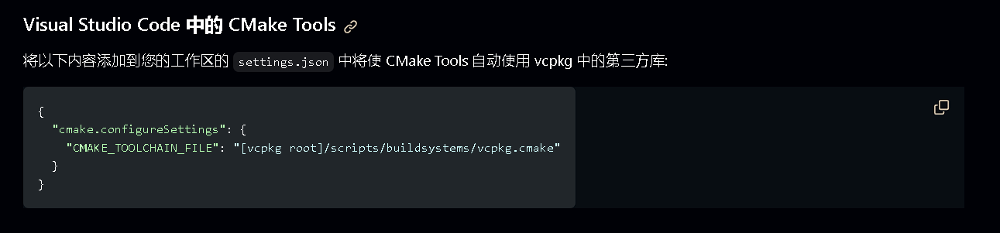
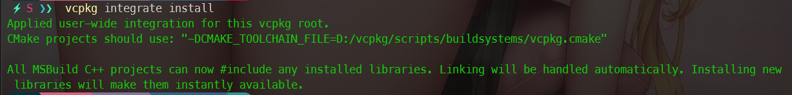
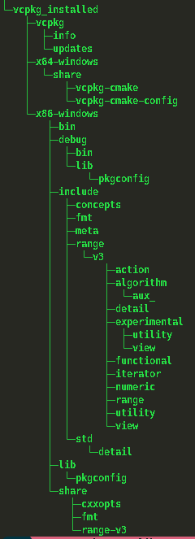
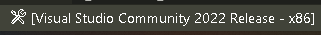
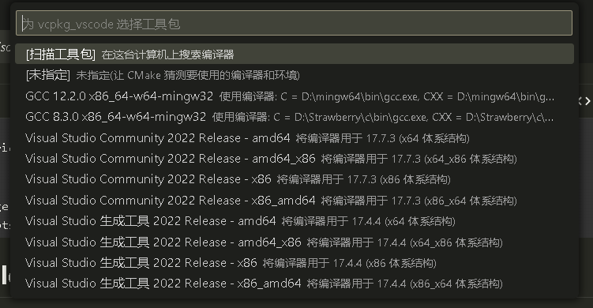
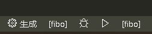
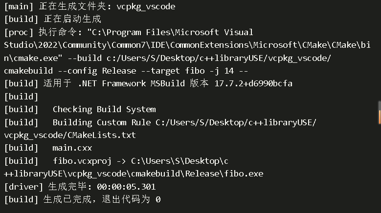
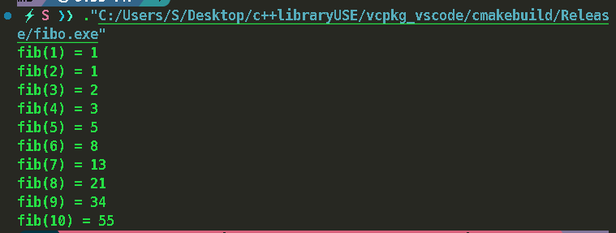

## 参考自官网地址, 详细情况请细看 [官网文档](https://learn.microsoft.com/zh-cn/vcpkg/)

## 安装vcpkg

* [vcpkg](https://github.com/microsoft/vcpkg)
* 配置path变量(可选)

## vscode CMAKE集成

**官方介绍:**



**示例setting.json:**

```json
{
  "cmake.configureSettings": {
    "CMAKE_TOOLCHAIN_FILE": "D:/vcpkg/scripts/buildsystems/vcpkg.cmake"
  },
  "cmake.buildDirectory": "${workspaceFolder}/cmakebuild",
  "cmake.automaticReconfigure": false
}
```

**CMAKE 工具链可以在这里看到:**



## 配置 vcpkg.json (可选)

在项目文件夹下创建vcpkg.json文件, 里面放项目的依赖.

```json
{
  "dependencies": ["cxxopts", "fmt", "range-v3"]
}
```

在vcpkg.json文件所在目录运行命令:   vcpkg install 就会安装vcpkg.json中的依赖库 (国内记得开代理)

会在文件所在目录生成 vcpkg_installed文件夹, 目录结构如下 :



## CMAKE 配置 CMakeLists.txt

**官方的示例代生成代码main.cxx:**

```cpp
#include <cxxopts.hpp>
#include <fmt/format.h>
#include <range/v3/view.hpp>

namespace view = ranges::views;

int fib(int x)
{
    int a = 0, b = 1;

    for (int it : view::repeat(0) | view::take(x))
    {
        (void)it;
        int tmp = a;
        a += b;
        b = tmp;
    }

    return a;
}

int main(int argc, char **argv)
{
    cxxopts::Options options("fibo", "Print the fibonacci sequence up to a value 'n'");
    options.add_options()("n,value", "The value to print to", cxxopts::value<int>()->default_value("10"));

    auto result = options.parse(argc, argv);
    auto n = result["value"].as<int>();

    for (int x : view::iota(1) | view::take(n))
    {
        fmt::print("fib({}) = {}\n", x, fib(x));
    }
}
```

**CMakeLists.txt例子:**

```cmake
cmake_minimum_required(VERSION 3.20)

project(fibonacci CXX)

find_package(fmt REQUIRED)
find_package(range-v3 REQUIRED)
find_package(cxxopts REQUIRED)

set(CMAKE_CXX_STANDARD 23)

add_executable(fibo main.cxx)

target_link_libraries(fibo
    PRIVATE
    fmt::fmt
    range-v3::range-v3
    cxxopts::cxxopts)
```

## CMAKE build

* 点底部bar选择生成编译工具 , 推荐选VS的  (😅, 选mingw运行fmt的例子失败, 不知道什么鬼原因)





* 选择生成目标:



* 等待生成



* 运行


